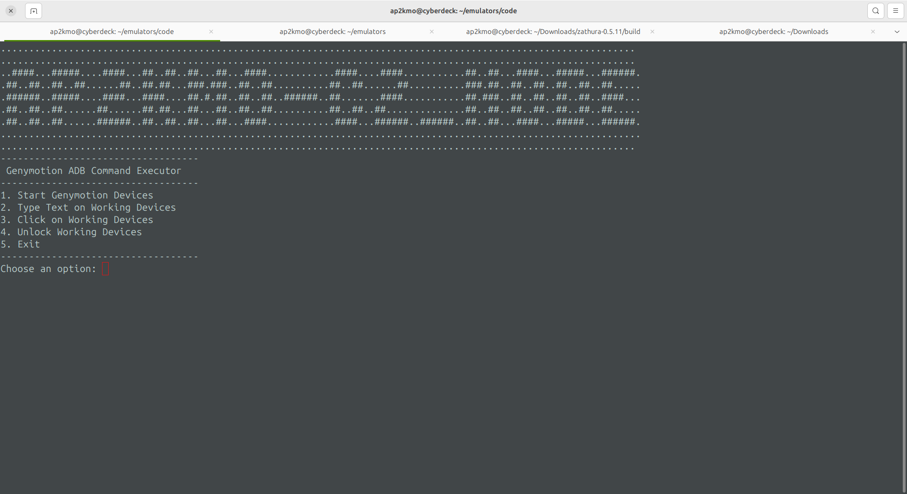

## C2 Script

## Installation

To get started, clone the repository to your local machine:

```bash
git clone https://github.com/yourusername/emulators.git
cd emulators/code
```


## Screenshot

Here is a screenshot showing the script in action:

